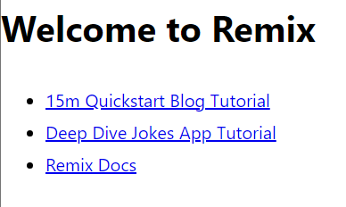
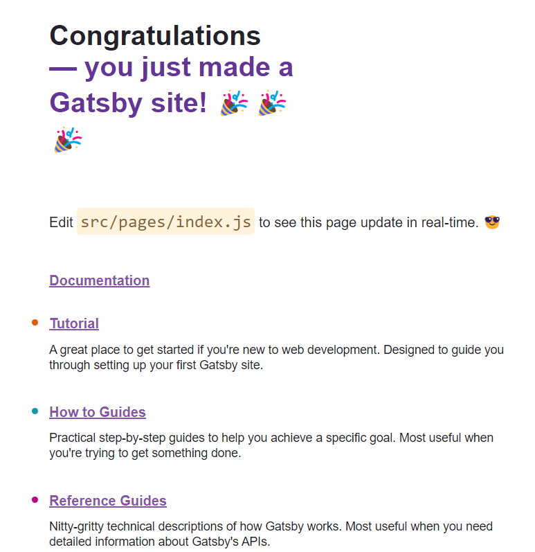
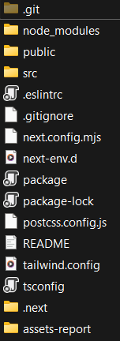
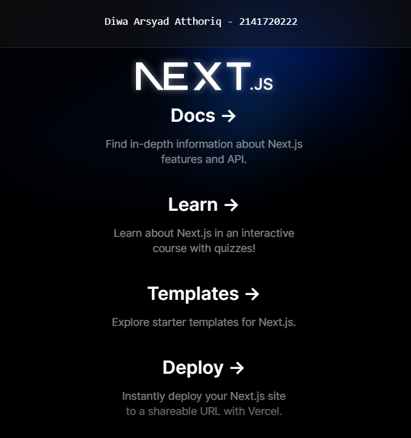
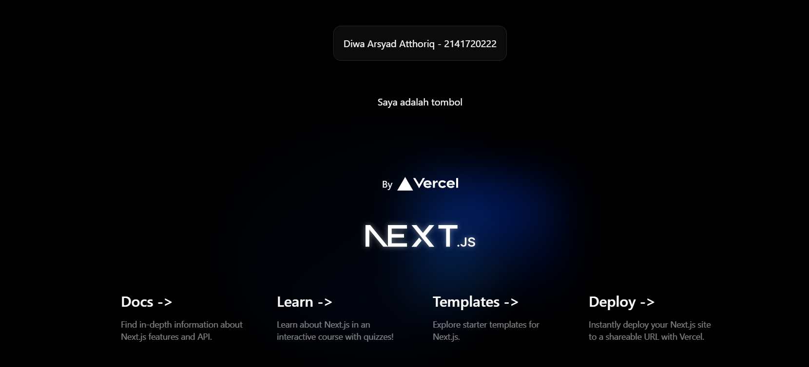
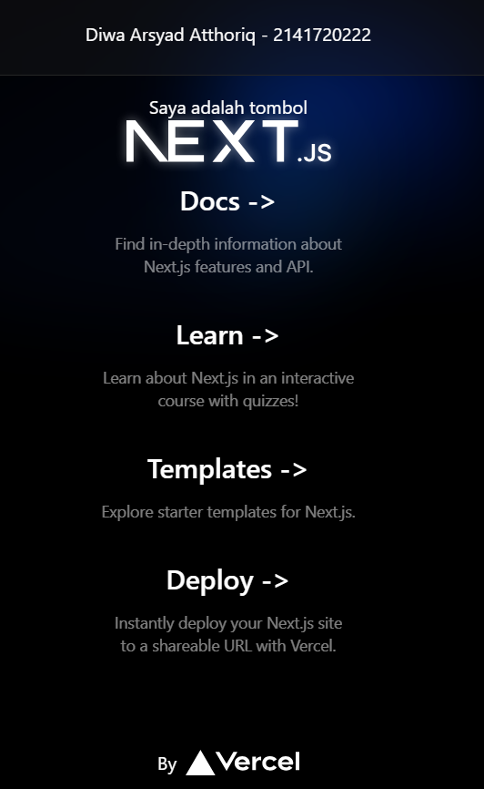
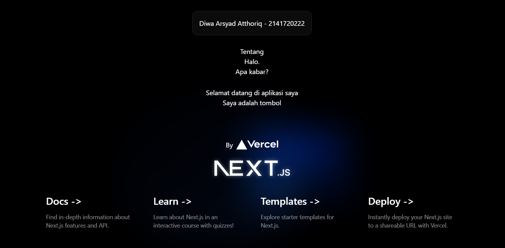
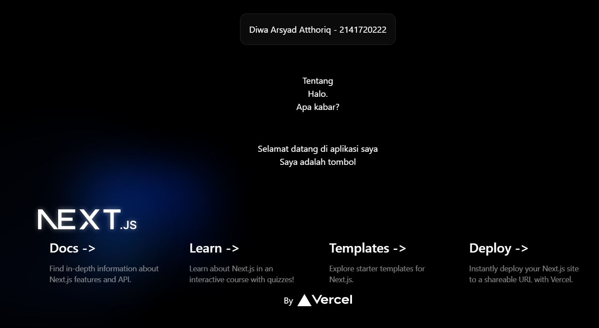

This is a [Next.js](https://nextjs.org/) project bootstrapped with [`create-next-app`](https://github.com/vercel/next.js/tree/canary/packages/create-next-app).

## Getting Started

First, run the development server:

```bash
npm run dev
# or
yarn dev
# or
pnpm dev
# or
bun dev
```

Open [http://localhost:3000](http://localhost:3000) with your browser to see the result.

You can start editing the page by modifying `app/page.tsx`. The page auto-updates as you edit the file.

This project uses [`next/font`](https://nextjs.org/docs/basic-features/font-optimization) to automatically optimize and load Inter, a custom Google Font.

## Laporan Praktikum

|       | Pemrograman Berbasis Framework 2024 |
| ----- | ----------------------------------- |
| NIM   | 2141720222                          |
| Nama  | Diwa Arsyad Atthoriq                |
| Kelas | TI - 3A                             |

### Soal 1

Pada gambar tersebut, silakan Anda browsing apa yang dimaksud dengan:

TypeScript
ESLint
Tailwind CSS
App Router
Import alias

### Jawaban Soal 1

TypeScript : Bahasa pemrograman yang merupakan superset dari JavaScript.

ESLint : Adalah salah satu plugin ESLint yang digunakan untuk memvalidasi kode program dan menghasilkan laporan error atau warning.

Tailwind CSS : Css utility framework yang memiliki konsep modular dan tidak menggunakan preprocessor seperti SASS atau LESS.

App Router : Mengacu pada router aplikasi, yang digunakan dalam pengembangan web untuk mengelola navigasi antar halaman atau komponen dalam aplikasi.
Import alias : Merupakan cara untuk mengganti nama import secara default menjadi nama lainnya.

## Remix



## Gatsby





### Soal 2

Pada struktur project tersebut, jelaskan kegunaan folder dan file masing-masing tersebut!

Bukti setup environment telah berhasil di komputer.

### Jawaban Soal 2

Folder :

1. src : Folder ini digunakan sebagai tempat penyimpanan kode sumber program.
2. public : Folder ini digunakan sebagai tempat penyimpanan file yang akan diakses oleh user melalui browser.
3. node_modules : Folder ini berisi modul Node.js yang digunakan proyek Anda.
4. .next : Folder ini berisi file yang dibuat oleh Next.js saat membangun atau menjalankan proyek Anda.
5. assets-report : Folder untuk menyimpan hasil screenshot atau bukti kerja.
6. .git : Folder ini berisi semua informasi tentang riwayat versi proyek Anda, termasuk snapshot dari kode Anda pada waktu yang berbeda, log komit, dan informasi tentang siapa yang membuat perubahan apa.

File :

1. .eslintrc: File ini berisi konfigurasi untuk ESLint, alat yang membantu Anda menemukan dan memperbaiki masalah dalam kode JavaScript Anda.
2. .gitignore: File ini berisi daftar file dan folder yang tidak ingin Anda lacak di Git.
3. next.config.mjs: File ini berisi konfigurasi untuk Next.js, kerangka kerja web React yang memungkinkan Anda membuat aplikasi web statis dan dinamis.
4. next-env.d: File ini berisi deklarasi tipe untuk variabel lingkungan yang digunakan proyek Anda.
5. package: File ini berisi informasi tentang dependensi Node.js proyek Anda.
6. package-lock: File ini berisi daftar lengkap semua dependensi Node.js proyek Anda dan versi spesifiknya.
7. postcss.config.js: File ini berisi konfigurasi untuk PostCSS, alat yang membantu Anda memproses dan mengubah kode CSS Anda.
8. README: File ini berisi laporan tentang proyek Anda, seperti tujuannya, cara menggunakannya, dan cara berkontribusi.
9. tailwind.config: File ini berisi konfigurasi untuk Tailwind CSS, kerangka kerja CSS yang membantu Anda membangun situs web dengan cepat dan mudah.
10. tsconfig: File ini berisi konfigurasi untuk TypeScript, superset JavaScript yang menambahkan fitur seperti pengetikan statis.

### Soal 3

Gantilah teks pada bagian atas dengan Nama - NIM Anda. Contoh seperti gambar berikut:

Jawaban dibuktikan dengan hasil screenshot.


Ketika Anda telah berhasil mengganti teks tersebut, Anda tidak perlu menjalankan perintah npm run dev dan tidak juga diperlukan me-reload halaman di browser. Tiba-tiba perubahan itu tampil, Mengapa terjadi demikian? Jelaskan!

### Jawaban Soal 3

Hal itu terjadi dikarenakan terdapat fitur HMR (Hot Module Replacement) yang berfungsi untuk melihat perubahan langsung tanpa perlu me-reload halaman.

## Komponen React



### Soal 4

Buatlah komponen MyTextNimName() berdasarkan kode dari soal nomor 3 sebelumnya. Lalu panggillah komponen tersebut. Apakah ada perubahan tampilan ? Mengapa demikian ?

### Jawaban Soal 4



Tidak terjadi perubahan dikarenakan fungsi dipanggil pada halaman home sudah tepat

## Menulis markup dengan JSX



### Soal 5

Buatlah komponen MyPage() berdasarkan project praktikum 1 ini yang berisi kode-kode HTML dari fungsi Home(). Lalu panggillah komponen tersebut. Apakah ada perubahan tampilan ? Mengapa demikian ?

### Jawaban Soal 5


Terjadi beberapa perubahan tampilan dikarenakan saat memanggil fungsi berurut sesuai fungsi yang diinginkan. Seperti pada gambar logo nextjs jadi dibawah teks teks yang lain. Semua tata letak berdasarkan urutan pemanggilan fungsi.

### Soal 6

Gunakanlah Kode JSX image tersebut, ganti dengan NIM, Nama Anda beserta link gambar ganti dengan foto Anda (bisa dari link medsos atau lainnya). Push codenya dan screenshot hasilnya.

### Jawaban Soal 6


